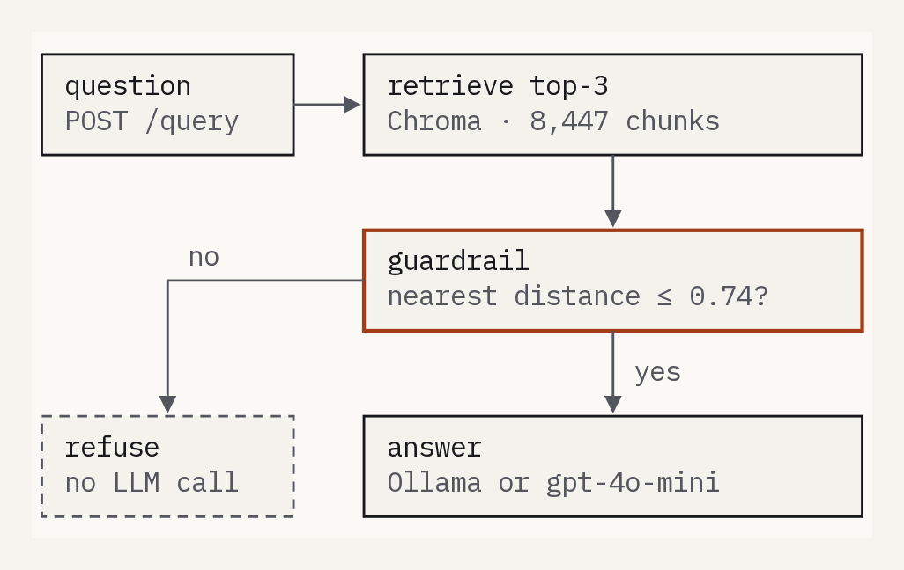
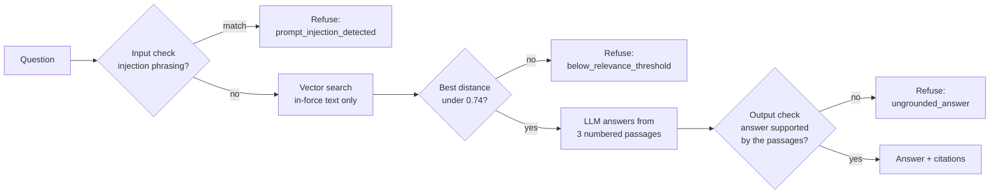

# RAG-Syntec



A RAG pipeline that knows when to refuse to answer — and can prove it.

It answers questions about the French Syntec collective agreement (IDCC 1486)
only from the agreement's text, cites the passages it used, and refuses when the
documents do not support an answer, saying why. Every design choice below was
measured on a labelled question set, with the expected result written down before
the measurement, and several of them were rejected by their own numbers.

> **Origin note.** The application skeleton started from a take-home RAG
> exercise. The architecture, the bug fixes, the guardrail calibration, the
> evaluation, the tests, the Docker/Compose setup, and everything documented in
> `design/` are original work built on top of that starting point.

> **Corpus note.** The indexed corpus is the French Syntec collective
> bargaining agreement (IDCC 1486), sourced from Légifrance/DILA under the
> Licence Ouverte / Open Licence 2.0 (Etalab) — free reuse, including
> commercial, with attribution. Contains no personal data. See
> [`design/corpus.md`](design/corpus.md) for the full scope and licensing
> position.

## Results

55 labelled questions (visible split): 22 answerable from the agreement, 11 about
the agreement but not answerable from it, 11 off-topic, 11 adversarial (prompt
injections written about the agreement's subject). Full table over every run:
[`eval/RESULTS.md`](eval/RESULTS.md).

| | baseline | final |
|---|---|---|
| a relevant passage in the 3 retrieved (hit@3) | 0.50 | **0.77** |
| recall@3 / MRR | 0.45 / 0.36 | **0.73 / 0.54** |
| answerable questions failing the answer check (of 22) | 10 | **7** |
| unanswerable questions answered with invented content (of 11) | 2 | 1 |
| adversarial questions followed (of 11) | 1 | **0** |
| off-topic questions answered (of 11) | 0 | 0 |
| in-topic questions wrongly refused by the guardrail (of 33) | 4 | 4 |
| answers citing at least one passage, invented citations | n/a | every substantive answer, 0 invented |

On the 20 held-out questions, read once at the end: hit@3 0.75, all 8 answerable
questions answered, but 2 of 4 adversarial questions got an answer where a refusal
was expected (neither revealed the instructions or wrote the harmful content
asked for; details in [`design/evaluation.md`](design/evaluation.md)). The
input check does not generalise beyond the questions it was written from.

Baseline: fixed 500-character chunks, `qwen3-embedding:8b` in Chroma, top 3
chunks, a distance threshold of 0.74, `gemma4` for generation. Final: the same,
plus superseded text filtered out, an input check and an output check, and
citations.

## How it works



- **Ingestion** (`app/services/ingestion.py`): the agreement's 172 texts,
  converted from Légifrance HTML to Markdown, split into 8 447 chunks; each chunk
  is tagged `in_force` from its article heading ("(non en vigueur)" marks a
  superseded version).
- **Retrieval and decision** (`app/services/retrieval.py`): squared-L2 distance
  in Chroma (lower is closer), superseded text filtered out, then the
  answer-or-refuse decision: the distance threshold, or an abstention classifier
  behind `GUARDRAIL_MODE=classifier`.
- **Generation** (`app/services/generation.py`): numbered passages, the model is
  asked to cite them as `[n]`; any number that matches no retrieved passage is
  rejected.
- **Guardrail layers** (`app/services/guardrail.py`, orchestrated by
  `app/services/pipeline.py`, which the API and the evaluation share).
- **API** (`app/api/routes.py`): `POST /query` returns the answer, the citations,
  the refusal reason, the per-stage latency and a request id found in every log
  line; `/health`, `/ready` (index loaded, Ollama reachable) and `/stats`.

## What was measured, in the order it was done

1. **Baseline and diagnosis** ([`design/evaluation.md`](design/evaluation.md),
   [`design/retrieval_diagnosis.md`](design/retrieval_diagnosis.md)). Each failure
   was classified as guardrail, retrieval or generation. For every answerable
   question the relevant passage was within the 10 nearest, so retrieval failures
   were ranking failures, not missing information. 20% of the index was repeated
   text.
2. **Control: 10 passages instead of 3.** Failing answerable questions went
   from 10 to 4, at +11% (median) to +26% (p95) generation time; the ranking itself
   was unchanged.
3. **Cross-encoder reranking: rejected** ([`design/reranking.md`](design/reranking.md)).
   Kept only if recall@3 rose by 0.15, it beat the control and it added at most 3
   s at p95, rules written before the run. It reached +0.136, failed more
   questions than the control and added 4.4 s. It also promoted a superseded text
   of the agreement and the system gave an outdated answer (2 years of seniority
   for the severance indemnity, where the text in force says 8 months).
4. **Filtering superseded text: the largest gain**
   ([`design/versioning.md`](design/versioning.md)). 40% of the index belonged to
   superseded articles. Filtering them took hit@3 from 0.50 to 0.77 with no model
   and no added step. It also exposed five golden labels pointing at outdated
   text, one of which had an outdated expected answer; they were corrected.
5. **Article-based chunking: not kept** ([`design/chunking.md`](design/chunking.md)).
   No retrieval gain on top of versioning, and a looser recalibrated threshold.
6. **Abstention classifier** ([`design/abstention.md`](design/abstention.md)).
   A logistic regression over 8 retrieval features did not rank questions better
   than the best distance alone (cross-validated ROC-AUC 0.862 against 0.898). At
   its operating point it refuses 8 more questions that should be refused, for 2
   more wrong refusals. Available behind a switch, not the default.
7. **Input and output checks** ([`design/guardrail.md`](design/guardrail.md)).
   The output check withdraws the one answer that followed an injection and none
   of the 17 correct answers; the input check catches 4 of 11 visible adversarial
   questions but 0 of 4 held-out ones, so it is a cheap filter, not a defence.

## Evaluation

- **Golden set** (`eval/golden.jsonl`, `eval/golden_held_out.jsonl`): 75
  labelled questions; 55 used to make decisions, 20 held out.
- **Runner:** `uv run python eval/run.py --label <name>` sends every question
  through the same pipeline as the API and writes a result file with the git
  SHA, the corpus hash and every setting.
- **Comparison and ablation:** `eval/compare_runs.py` compares two runs on the
  same footing (same k, current labels, each run's own chunking);
  `eval/ablation.py` prints the table over every run.
- **Failure taxonomy:** `eval/failures.py` puts each failure in one category,
  each pointing to a different fix.
- **Metrics** are implemented from scratch (recall@k, MRR, false-refusal and
  false-acceptance rates, a lexical faithfulness proxy). An LLM judge was tried
  and agreed with human labels 55% of the time, so it is not used
  ([`design/generation_eval.md`](design/generation_eval.md)).

**Limits.** 22 answerable questions: one question is about 0.045 of a rate, so
small differences are noise. Answers are checked lexically against an expected
answer, not read one by one. The held-out split was read twice: once for the
classifier, once for a final end-to-end run. One labeller.

## Run it

### Locally, with uv

```bash
uv sync
cp .env.example .env   # local mode uses Ollama; see the comments in the file
ollama pull qwen3-embedding:8b && ollama pull gemma4:latest
uv run uvicorn app.main:app
```

The first start builds the index (about 8 minutes on an 8 GB GPU); later starts
reuse it as long as the documents, the chunking and the embedding model are
unchanged.

```bash
curl -X POST http://localhost:8000/query \
  -H "Content-Type: application/json" \
  -d '{"question": "Mon employeur veut mettre fin à mon essai après 4 mois de présence, combien de temps doit-il me prévenir ?"}'
```

Demo interface (calls the API): `uv sync --extra demo && uv run python demo/app.py`.

### With Docker Compose

```bash
cp .env.example .env
docker compose up -d ollama
docker compose exec ollama ollama pull qwen3-embedding:8b
docker compose exec ollama ollama pull gemma4:latest
docker compose up --build   # app on :8000, demo on :7860
```

The Compose file validates; a cold start from a clean clone has not been timed.

### Tests

```bash
uv run pytest            # 203 tests, about 10 s, no network or model needed
uv run pytest -m eval    # guardrail regression check on the real index (needs Ollama)
```

Coverage: 88% of `app/` ([`design/testing.md`](design/testing.md)).

## Repository map

| Path | Role |
|---|---|
| `app/` | API, settings, and the pipeline services |
| `eval/` | golden set, metrics, runner, failure taxonomy, comparison, ablation, results |
| `scripts/` | corpus acquisition and manifest, threshold calibration, diagnosis scripts, classifier training |
| `design/` | one document per decision: problem, decision, why, measured result, cost |
| `demo/` | Gradio page over the API |
| `models/abstention.json` | the classifier's coefficients (JSON, no pickle) |
| `tests/` | the test suite |

## Sources

- R. Nogueira, K. Cho, *Passage Re-ranking with BERT*, 2019,
  [arXiv:1901.04085](https://arxiv.org/abs/1901.04085): reranking passages with
  a BERT cross-encoder, reported as improving MRR@10 on MS MARCO by 27% (relative)
  over the previous state of the art. Basis for the two-stage design (retrieve,
  then rerank).
- Sentence-Transformers documentation, *Retrieve & Re-Rank*,
  [sbert.net](https://www.sbert.net/examples/applications/retrieve_rerank/README.html):
  why a fast bi-encoder is used to pick candidates and a more accurate but slower
  cross-encoder to rank them.
- M. Eibich, S. Nagpal, A. Fred-Ojala, *ARAGOG: Advanced RAG Output Grading*,
  2024, [arXiv:2404.01037](https://arxiv.org/abs/2404.01037): found that LLM
  reranking improved retrieval precision, while Cohere rerank and MMR showed no
  notable advantage over a naive RAG baseline. The counter-evidence that made
  measuring on this corpus necessary.
- Y. Zhang et al., *Qwen3 Embedding: Advancing Text Embedding and Reranking
  Through Foundation Models*, 2025,
  [arXiv:2506.05176](https://arxiv.org/abs/2506.05176), and the
  [Qwen3-Reranker-0.6B model card](https://huggingface.co/Qwen/Qwen3-Reranker-0.6B)
  (Apache 2.0 licence, loaded through `sentence-transformers`): the reranker
  tested.
- Every other design choice and its sources (books and papers, each read and quoted): [`design/sources.md`](design/sources.md).
- S. Es et al., *Ragas: Automated Evaluation of Retrieval Augmented
  Generation*, 2023, [arXiv:2309.15217](https://arxiv.org/abs/2309.15217): the
  vocabulary used for the generation metrics (faithfulness, context relevance).
  The metrics here are implemented from scratch, not taken from the library.

## Status

The roadmap in [`TODO.md`](TODO.md) is complete except for what it marks as
skipped, each with its reason: a new embedding model, Qdrant and hybrid search
(the diagnosis found no coverage failure for them to fix), and Langfuse
(optional). Still to do: timing a cold Docker start and recording the demo; an
article draft, CV notes and interview notes are in `docs/`.

## License

MIT — see [LICENSE](LICENSE).
